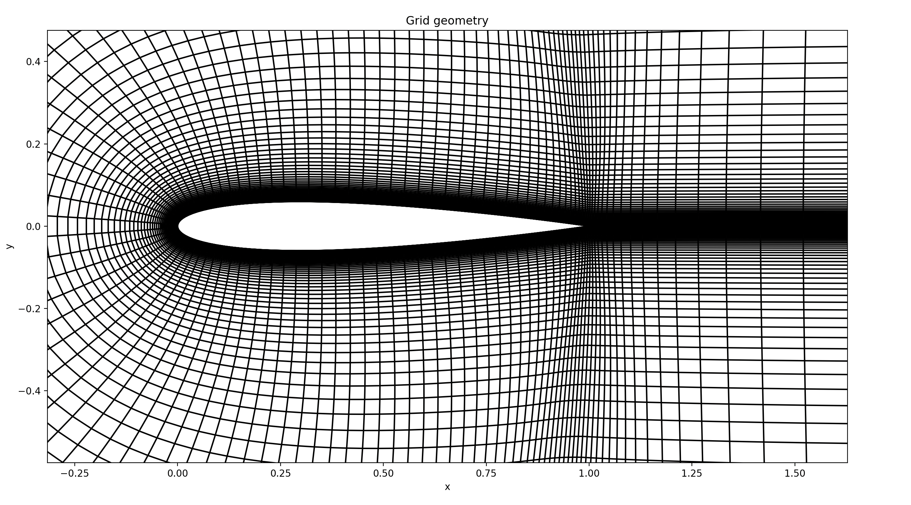

# GFOIL36

Collocated FD code for DNS (or ILES) of incompressible flows on airfoils.
GPU-ready code that can be accelerated using a single-GPU strategy.
Construct2D is used to generate the C-grid.
Profile is then extretued along the spanwise direction.
The code is meant for teachig purposes and is currently under development (15/04/26)

# C-grid generation 
For the generation of the C-grid, two methods are available:
- Construct2D, see the doc inside the folded, it has many parameters to stretch or not the grid.
- simplecgrid, script 