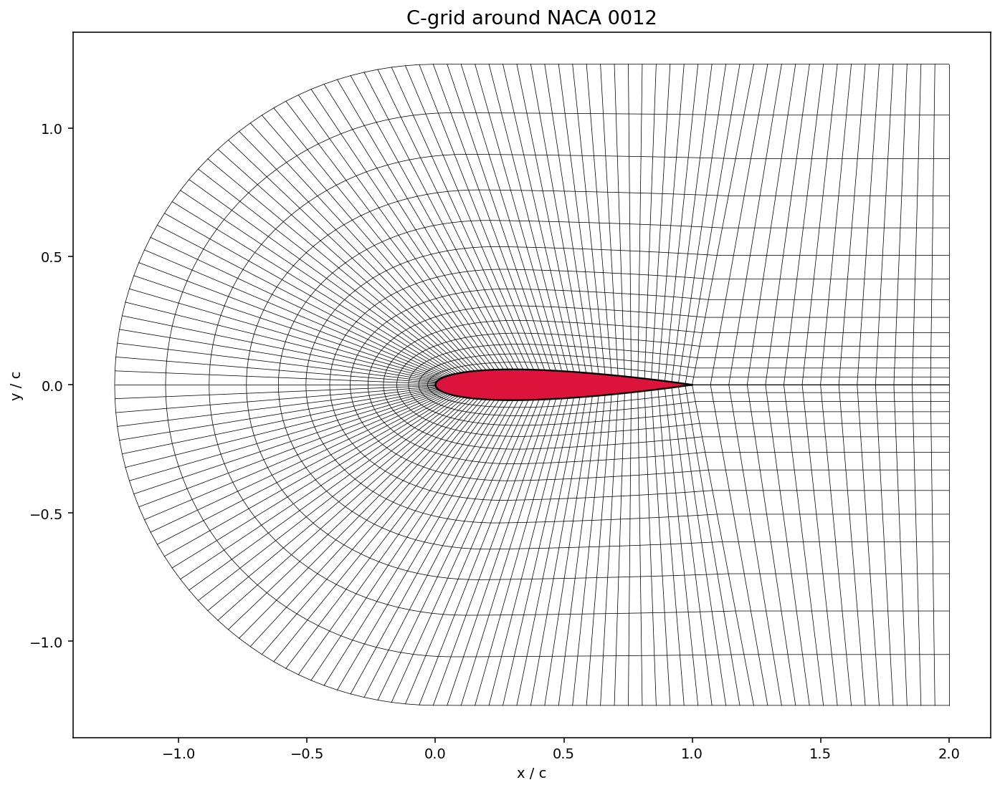

# GFOIL36

Collocated FD code for DNS (or ILES) of incompressible flows on airfoils.
GPU-ready code that can be accelerated using a single-GPU strategy.
Construct2D is used to generate the C-grid.
Profile is then extretued along the spanwise direction.
The code is meant for teachig purposes and is currently under development (21/04/26).

# C-grid generation 
For the generation of the C-grid, two methods are available:
- Construct2D, see the doc inside the folded, quite complete software for mesh generation. Many different parameters to stretch or not the grid can be selected. A .P3D file containing a 2D grid will be generated.
- simplecgrid, simple pythons script (derived from https://alpynepyano.github.io/healthyNumerics/posts/cfd-03-grids-for-airfoils.html) to generate a C-grid on a NACA 0012 airfoil. Easy to use for debug run and very coarse grid. Also this script generates a .P3D file containing a 2D grid. 

# Feautures implemented
The follwoing features has bene implemented and tested:
- Grid generation using simplecgrid ✅
- Grid generation using Construct2D ✅
- Read of P3D file ✅
- Check P3D file ✅
- Paraview of Grid ✅
- Output of file solutions (structured grid + P3D?)
- Diffusive terms (explicit)
- Diffusive terms (impkicit)

